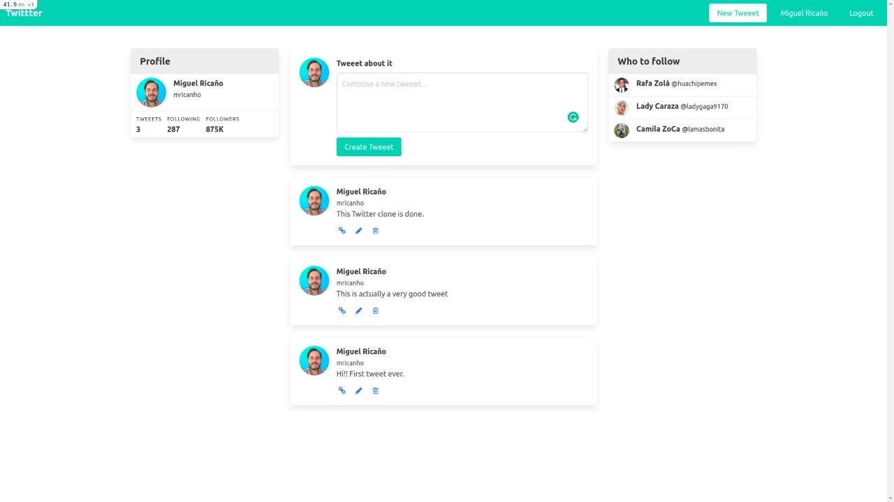

# Twitter Clone

In this project, I build a fully functional primite Twitter. The scope is to test the knowledge of routes, models, controllers and views of Ruby on Rails.


## Built With

- Ruby 2.7.2
- Ruby on Rails 6.1.1

### Setup

To run this project locally, please ensure you have Ruby and Ruby on Rails installed on your machine, then clone this repository by running.

```bash
git clone https://github.com/mricanho/Bare-metal-form
```
Open your terminal and CD to the directory where you create the clone repository.

Now run:

```bash
bundle install
```
Then run:

```bash
rails db:migrate
```
After that put:
```bash
rails s
```
To set up the server.

After this you can open your favorite web-browser and copy paste the next:

```bash
http://localhost:3000
```
### Author

👤 *Miguel Ricaño*

- Github: [@mricanho](https://github.com/mricanho)
- Linkedin: [Miguel Ricaño](https://www.linkedin.com/in/mricanho/)

## Show your support

Give a ⭐️ if you like this project!

## Acknowledgments

- Microverse
- The Odin Project

## 📝 License

This project is [MIT](LICENSE) licensed.